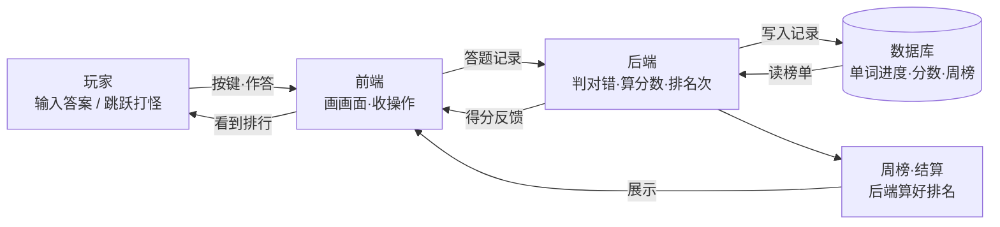

# 技术设计（TECH_DESIGN）

> 状态：Day 5 初稿。对应 PRD：`docs/prd.md`；立项原则见 `docs/research.md` 第四节（轻量化、无压力、正反馈、社群娱乐优先）。

## 一、技术路线

### 结论先行

**采用路线 B：前端 + 轻后端 + SQLite。**
理由一句话：周榜是核心功能，必须有大家都能读写的服务器端存储；同时在三条候选里它是唯一既轻量、又能看清每个部件怎么工作的路线。

### 候选路线比较

| | 路线 A：纯前端 + localStorage | 路线 B：前端 + 轻后端 + SQLite ✅ | 路线 C：云服务全家桶 |
|---|---|---|---|
| 组成 | 单个网页，数据存玩家浏览器 | 网页 + 一个小程序（Node.js）+ 单文件数据库 | 后端/数据库用现成云服务（Supabase/Firebase 类） |
| 能做周榜吗 | ❌ 数据锁在各人电脑里 | ✅ 分数存在服务器，人人可读 | ✅ |
| 轻量程度 | 最轻 | 轻：一台小服务器 + 一个文件 | 看似轻，实际绑定外部平台 |
| 可控/可学习 | 高 | 高：每个部件看得见摸得着 | 低：黑盒，出问题难排查 |
| 成本 | 0 | 接近 0（免费额度或小型主机） | 免费额度内可跑，超了要钱 |
| 依赖风险 | 无 | 无 | 平台改政策/涨价即被动 |

### 暂时选它的理由（写给自己）

1. **功能约束**：周榜 + 每周玩梗称号需要"一份大家共读的数据"，纯前端方案天生做不到，只有 B/C 可选。
2. **学习目标**：本项目是学习驱动的，路线 B 让前端、后端、数据库三层都亲手碰一遍；路线 C 会把后端藏进黑盒。
3. **立项原则对齐**：轻量化 = 不租大机器、不引入复杂框架；SQLite 是单文件数据库，拷走就是备份，最符合"无压力"。
4. **留了后路**：SQLite 的表结构将来迁去 PostgreSQL（路线 C 类平台）成本低，先跑通闭环要紧。

### 明确不做（本期）

- 不做用户注册/登录体系：**玩不需要任何身份，上榜才需要一个昵称**（打开网页直接玩；分数进周榜时提示起名）。允许重名，本期不区分同名人，撞名再加小尾巴。对应 PRD 砍功能决策。
- 不做云部署弹性扩容，一台小服务器跑得动就行。
- 不引入重型框架（如 React 全家桶），先用简单直接的页面方案。

## 二、数据流图

一句话：数据从玩家的手来，经前端送算、后端算账、数据库记账，最后变回榜单回到玩家眼前。

### 数据从哪来、到哪去（逐条说清）

| 数据 | 从哪来 | 到哪去 |
|---|---|---|
| 答题记录（哪个词、答了什么） | 玩家在前端作答 | 前端发给后端判对错，结果写进数据库 |
| 得分（本局分数） | 后端按击杀和波数结算 | 存入数据库，本局内同时返回前端显示 |
| 周榜排名 | 数据库里本周的分数记录 | 后端排序后交前端画成排行榜给玩家看 |
| 昵称 | 玩家在结算时起名 | 随分数一起存入数据库，挂在周榜上 |

> 注：本期玩法免登录（见"明确不做"），所以数据流里没有账号环节；以后若加登录，只需在"玩家→前端"之间加一步身份确认，其余流向不变。

## 三、影响面表格：方案变化时哪些文件会受影响

> 用途：以后想改方案时，先查这张表，知道要动哪几个文件、会不会牵连别的。`frontend/`、`backend/` 是将来写代码时会建的目录（现在还没有）。

| 如果方案变化… | 受影响文件 | 会不会牵连别的 |
|---|---|---|
| 换数据库（SQLite → PostgreSQL 等） | `backend/`（连接与建表代码）、本文档技术路线节 | 数据流图不变；周榜功能不变 |
| 换后端语言/框架（Node.js → Python 等） | `backend/` 全部、本文档技术路线节 | 数据流图不变；前端只认接口，理论上无感 |
| 换前端框架（朴素页面 → React 等） | `frontend/` 全部、根目录 `index.html`、本文档技术路线节 | 后端接口不变则后端无感；PRD 不动 |
| 增加登录/注册 | `frontend/`（登录页）、`backend/`（账号逻辑）、数据库新表、本文档 + PRD | 数据流图要加身份环节；周榜逻辑微调 |
| 空军怪物上线 | `frontend/`（战斗画面）、`backend/`（结算规则如涉及） | 需回头确认 PRD 中空军条目；数据流不变 |
| 加装备系统（体力/装备变强） | `frontend/`、`backend/`、数据库新表、PRD 补装备创意 | 影响面最大，牵动需求+技术两层 |
| 只改玩法数值（怪血量、词库等） | `frontend/` 或词库数据文件 | 基本无牵连，最安全的一类改动 |

